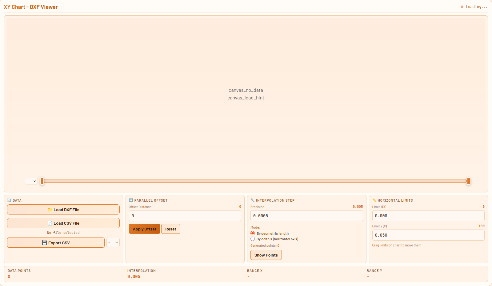
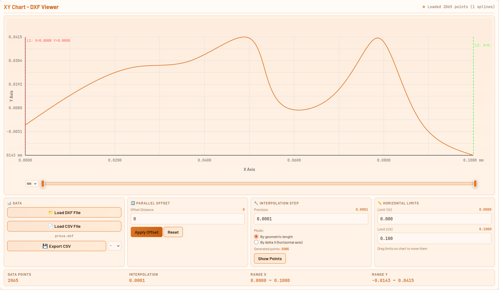
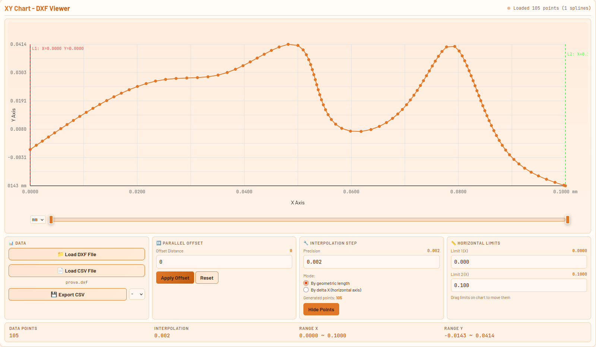
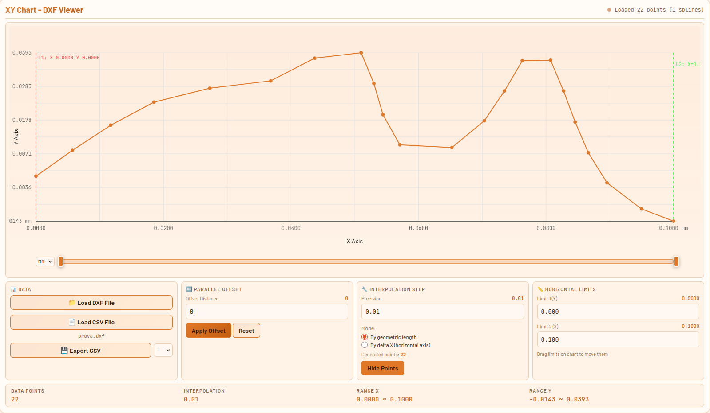
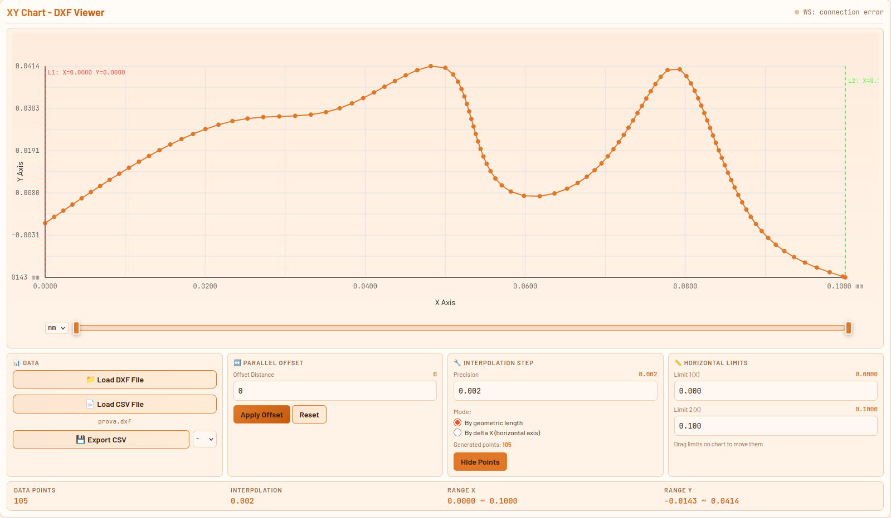
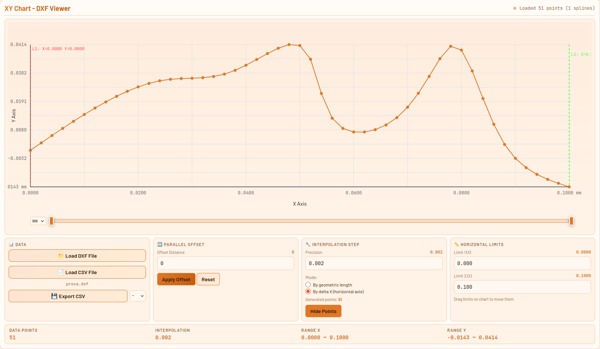
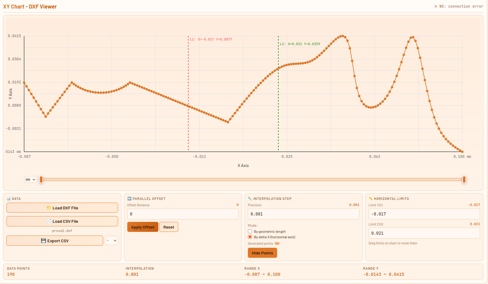
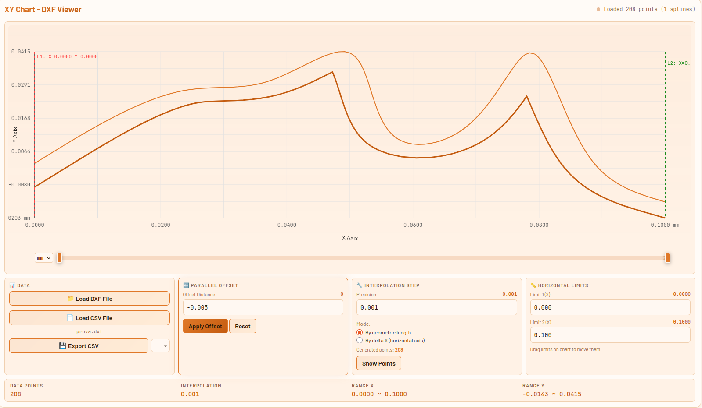
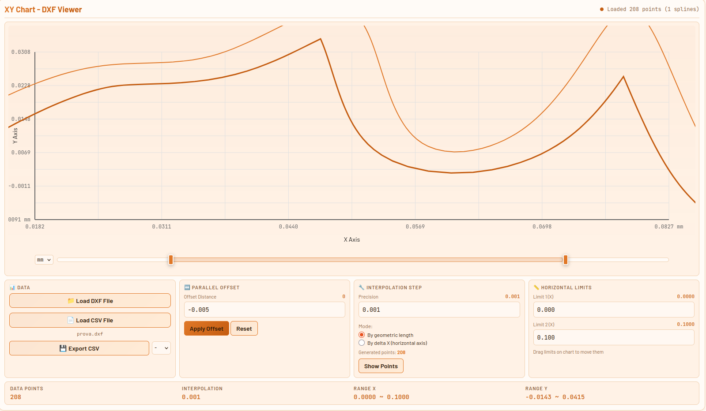

# Manuale Utente — Visualizzatore Profilo DXF

---

## Indice

1. [Panoramica](#1-panoramica)
2. [Formati file supportati](#2-formati-file-supportati)
3. [Interfaccia](#3-interfaccia)
4. [Flusso di lavoro tipico](#4-flusso-di-lavoro-tipico)
5. [Importazione DXF](#5-importazione-dxf)
6. [Tipi di curva e compatibilità](#6-tipi-di-curva-e-compatibilità)
7. [Interpolazione](#7-interpolazione)
8. [Limiti orizzontali (L1 / L2)](#8-limiti-orizzontali-l1--l2)
9. [Offset parallelo](#9-offset-parallelo)
10. [Esportazione CSV](#10-esportazione-csv)
11. [Unità di misura](#11-unità-di-misura)
12. [Zoom e navigazione](#12-zoom-e-navigazione)

---

## 1. Panoramica

Il visualizzatore profilo consente di:

- Importare un profilo geometrico da file **DXF** o **CSV**
- Visualizzarlo su grafico con scala reale
- Ritagliarlo nella zona di interesse tramite limiti orizzontali
- Calcolare la **curva offset parallela** a distanza configurabile
- Esportare i punti risultanti come **CSV** pronto per il controllo macchina



---

## 2. Formati file supportati

### 2.1 File DXF

Il formato DXF (Drawing Exchange Format) è lo standard di interscambio CAD.

**Versioni compatibili:** DXF R12 e successive (ASCII).

**Entità geometriche riconosciute:**

| Entità DXF | Descrizione | Note |
|---|---|---|
| `LINE` | Segmento rettilineo | Supporto completo |
| `ARC` | Arco di circonferenza | Supporto completo |
| `CIRCLE` | Circonferenza intera | Vedi §6 per limitazioni offset |
| `LWPOLYLINE` | Polilinea 2D leggera | La più comune nei profili CAD |
| `POLYLINE` | Polilinea classica | Supporto completo |
| `SPLINE` | Curva B-spline | Valutata tramite algoritmo de Boor sui punti di controllo |

**Entità non riconosciute** (presenti nel DXF ma ignorate): blocchi (`BLOCK`), testi (`TEXT`, `MTEXT`), quote (`DIMENSION`), tratteggi (`HATCH`), entità 3D.

**Unità di misura nel DXF:**  
Se il file contiene il campo `$INSUNITS` nell'intestazione, l'unità viene rilevata automaticamente e impostata nel selettore UM. In assenza di questo campo, l'unità rimane quella selezionata manualmente.

**Consigli per preparare il DXF:**
- Esportare solo il profilo utile, senza layer decorativi
- Utilizzare un unico layer o assicurarsi che tutte le entità siano sul piano XY (Z = 0)
- Evitare spline con meno di 2 punti di controllo
- Preferire LWPOLYLINE a POLYLINE quando possibile

### 2.2 File CSV

Il CSV è il formato di importazione per profili già discretizzati.

**Struttura attesa:**

```
X,Y
0.000000,0.059640
0.002332,0.064063
0.004664,0.068486
...
```

- Prima riga: intestazione (obbligatoria, può contenere qualsiasi testo)
- Colonne: prima colonna X, seconda colonna Y
- Separatore: virgola (`,`)
- Decimale: punto (`.`)
- I punti vengono ordinati automaticamente per X crescente al momento dell'importazione

---

## 3. Interfaccia

### Pannello in basso

Il pannello in basso contiene tutte le impostazioni operative, organizzate in sezioni:

- **Dati** — caricamento file DXF e CSV
- **Offset Parallelo** — distanza e applicazione offset
- **Passo Interpolazione** — configurazione densità punti e visualizzazione punti
- **Limiti Orizzontali** — definizione zona di taglio (L1, L2)

### Area grafico

Il grafico mostra il profilo con:
- Curva originale in **arancione**
- Curva offset parallela in **arancione scuro** (quando attiva)
- Linee limite L1 e L2 in **rosso/verde** (trascinabili)
- Griglia di riferimento in grigio chiaro
- Assi con valori nell'unità di misura selezionata

### Barra zoom

Sotto il grafico: due cursori che definiscono la finestra di visualizzazione sull'asse X. Trascina i cursori per restringere o allargare la vista.

---

## 4. Flusso di lavoro tipico

Il percorso standard dal file CAD all'esportazione è il seguente:

```
File DXF
    │
    ▼
[Importa DXF]  ──→  Il profilo appare sul grafico
    │
    ▼
[Verifica Passo Interpolazione]  ──→  Calcolato automaticamente al caricamento
    │
    ▼
[Posiziona L1 e L2]  ──→  Ritaglio della zona di interesse
    │
    ▼
[Imposta distanza Offset]  ──→  Calcola curva parallela
[Applica Offset]
    │
    ▼
[Seleziona UM esportazione]
[Esporta CSV]  ──→  File di punti pronto per la macchina
```

---

## 5. Importazione DXF

1. Premere **📁 Carica File DXF**
2. Selezionare il file `.dxf` dal disco
3. Il sistema estrae automaticamente tutte le entità supportate e le converte in una sequenza di punti interpolati
4. Il grafico si aggiorna mostrando il profilo completo
5. La barra di stato mostra il numero di punti estratti e le entità riconosciute (es. `Caricati 1243 punti — 3 splines, 2 archi`)

**Nota:** se il DXF contiene entità non supportate o corrotte, vengono silenziosamente ignorate. Se il profilo appare incompleto, verificare nel CAD che tutte le entità siano di tipo supportato (§2.1).

---

## 6. Tipi di curva e compatibilità

> ⚠️ **Il sistema è progettato esclusivamente per profili aperti.** Un profilo aperto ha un punto iniziale e un punto finale distinti e si sviluppa con X monotonamente crescente (da sinistra a destra). Profili chiusi (cerchi, polilinee chiuse, ecc.) non sono supportati e producono risultati imprevedibili.

### 6.1 Profilo aperto

Un profilo aperto è una sequenza di curve con punto iniziale e finale distinti, tipicamente un profilo di lavorazione, una camma o una sezione.

**Requisiti:**
- X crescente da inizio a fine (nessuna re-entranza in X)
- Profilo contenuto nel piano XY (Z = 0 nel DXF)



### 6.2 Spline

Le curve SPLINE vengono valutate con l'**algoritmo di de Boor** (B-Spline). Se il DXF contiene il vettore dei nodi (group code 40), viene usato direttamente; altrimenti viene generato automaticamente in modo che la curva passi esattamente per il primo e l'ultimo punto di controllo con spaziatura regolare.

Il calcolo avviene sui **punti di controllo** (group code 10/20). I punti di fitting (group code 11/21), se presenti, vengono usati come fallback solo quando i punti di controllo non sono disponibili.

La curva ad alta risoluzione generata dall'algoritmo viene poi ricampionata con il passo di interpolazione impostato (vedi §7).

### 6.3 Archi

Gli archi vengono interpolati calcolando la suddivisione angolare necessaria a rispettare il passo impostato (in modalità lunghezza) o il passo sull'asse X (in modalità delta X).

### 6.4 Curve problematiche per l'offset

L'algoritmo di offset parallelo gestisce automaticamente le auto-intersezioni tramite backtracking, ma alcune geometrie richiedono attenzione:

| Situazione | Effetto | Soluzione |
|---|---|---|
| Angoli acuti (< 30°) con offset grande | La retta offset si interseca molto indietro, possibile perdita di segmenti | Ridurre la distanza di offset |
| Segmenti quasi verticali | Intersezione fuori range, il segmento viene tagliato al limite | Normale, il clipping è automatico |
| Profilo con inversione in X (torna indietro) | L'ordinamento per X può produrre risultati errati | Evitare curve con re-entranze in X |
| Raggio di curvatura < distanza offset | La curva interna collassa su se stessa | Ridurre la distanza di offset |


---

## 7. Interpolazione

### 7.1 Che cos'è l'interpolazione

Tutte le entità geometriche del DXF (linee, archi, spline) vengono convertite in una sequenza discreta di punti (X, Y). Il **passo di interpolazione** determina quanti punti vengono generati e con quale spaziatura.

Un passo **piccolo** produce più punti e maggiore precisione geometrica, ma un file di output più grande.  
Un passo **grande** produce meno punti, sufficiente per profili con curvature graduali.

### 7.2 Passo di interpolazione

Il valore si imposta nel campo **Precisione** nella sezione "Passo Interpolazione".

- **Unità:** nell'unità di misura corrente (mm, m, ecc.)
- **Valore automatico:** al caricamento di un file, il passo viene impostato automaticamente al massimo scarto in X tra due punti consecutivi del file sorgente, arrotondato alla prima cifra significativa. Questo garantisce che ogni gap originale riceva almeno un punto interpolato, usando il passo più grande possibile. Il valore può essere modificato manualmente in qualsiasi momento.





### 7.3 Modalità di interpolazione

Sono disponibili due modalità, selezionabili con i pulsanti radio:

---

#### Modalità A — Su lunghezza geometrica

> **Campiona ogni N unità lungo la curva reale**

Il passo si misura sulla lunghezza dell'arco della curva. Il numero di punti generati dipende dalla lunghezza totale della curva.

**Formula per un segmento:**  
`n_punti = floor(lunghezza_segmento / passo) + 1`

**Formula per un arco:**  
`n_punti = floor(lunghezza_arco / passo) + 1`  
dove `lunghezza_arco = raggio × angolo_in_radianti`

**Quando usarla:**
- Profili con tratti a diversa inclinazione (la densità è uniforme ovunque)
- Quando serve una distribuzione omogenea dei punti lungo il percorso
- Con archi e spline che hanno curvatura variabile

**Esempio:** un arco di raggio 10mm e ampiezza 90° con passo 0.5mm genera:  
`lunghezza = 10 × π/2 ≈ 15.7mm` → circa 31 punti



---

#### Modalità B — Su delta X (asse orizzontale)

> **Campiona ogni N unità sull'asse X**

Il passo si misura sulla componente orizzontale (ΔX). Il numero di punti dipende dall'escursione in X della curva.

**Formula per un segmento:**  
`n_punti = floor(|x2 - x1| / passo) + 1`

**Caso speciale — segmenti verticali:**  
Un segmento con ΔX ≈ 0 genera solo i due punti estremi (inizio e fine), indipendentemente dal passo.

**Formula per un arco:**  
Si calcola l'escursione in X dell'arco (considerando gli eventuali attraversamenti degli assi), poi si suddivide.

**Quando usarla:**
- Controlli numerici che richiedono passo costante in X
- Profili prevalentemente orizzontali
- Quando la coordinata X è l'asse di avanzamento macchina

**Attenzione:** su segmenti molto inclinati (quasi verticali), questa modalità genera pochissimi punti. Su archi che attraversano i 90° o i 270°, la proiezione in X può essere ridotta: verificare sempre il risultato visivamente.



---

### 7.4 Visualizzazione dei punti interpolati

Il pulsante **Mostra Punti** nella sezione interpolazione visualizza sul grafico i singoli punti generati dall'interpolazione come cerchi di piccole dimensioni (colore arancione). Premere nuovamente per nasconderli (**Nascondi Punti**).

Questa funzione è utile per verificare visivamente la densità e la distribuzione dei punti prima dell'esportazione.

### 7.5 Interazione tra interpolazione e offset

L'interpolazione viene applicata prima del calcolo dell'offset. I segmenti risultanti dall'interpolazione sono i segmenti su cui viene costruita la curva offset. Quindi:

- Un passo più fine produce segmenti più corti → l'offset approssima meglio le curve
- Un passo troppo grande su una spline → l'offset diventa poligonale (angoloso)

**Regola pratica:** se l'offset risulta angoloso, ridurre il passo di interpolazione.

---

## 8. Limiti orizzontali (L1 / L2)

I limiti L1 e L2 definiscono la **zona di interesse** del profilo: solo i punti compresi tra L1 e L2 verranno inclusi nell'esportazione.

### Impostazione

**Tramite trascinamento:** cliccare e trascinare le linee verticali direttamente sul grafico.

**Tramite input numerico:** digitare il valore nel campo corrispondente (L1 e L2 nel pannello in basso).



### Comportamento all'esportazione

Il CSV esportato conterrà solo i punti con `X ≥ min(L1, L2)` e `X ≤ max(L1, L2)`, ordinati per X crescente. Il punto con X minore viene riposizionato a X = 0 nel file esportato (vedi §10.2).

---

## 9. Offset parallelo

### 9.1 Principio

L'offset parallelo calcola una nuova curva a **distanza costante** dal profilo originale, misurata perpendicolarmente in ogni punto. Questo è equivalente a traslare ogni segmento nella direzione della sua normale.



### 9.2 Utilizzo

1. Impostare la **distanza di offset** nel campo apposito (valore positivo = sposta la curva verso l'alto per profili prevalentemente orizzontali, negativo verso il basso)
2. Premere **Applica Offset**
3. La curva offset appare in arancione scuro
4. La curva offset è quella che verrà esportata se presente (priorità sull'originale)

### 9.3 Estensione ai bordi

La curva offset viene automaticamente **estesa o tagliata** alle coordinate X del primo e dell'ultimo punto del profilo originale. Questo garantisce che la curva offset copra l'intero range del profilo senza tratti che escono dall'area di interesse.

### 9.4 Limiti dell'algoritmo

- **Angoli molto acuti** con offset grande: il punto di intersezione può cadere molto lontano, fuori dal range del profilo. Il sistema taglia automaticamente al limite.
- **Raggio di curvatura inferiore alla distanza di offset**: la curva interna collassa. Ridurre l'offset.
- **Profili non monotoni in X**: l'algoritmo è ottimizzato per profili con X sempre crescente. Curve che tornano indietro in X possono produrre risultati errati.

---

## 10. Esportazione CSV

### 10.1 Procedura

1. Selezionare l'**unità di misura di esportazione** nel selettore accanto al pulsante (es. `mm`, `m`)
2. Premere **💾 Esporta CSV**
3. Scegliere nome e posizione del file nella finestra di dialogo

### 10.2 Contenuto del file esportato

Il CSV esportato contiene:

- **Intestazione:** `x_mm,y_mm` (o con l'unità selezionata, es. `x_m,y_m`)
- **Punti:** solo quelli compresi tra L1 e L2, ordinati per X crescente
- **Origine X a zero:** la X del primo punto viene sottratta da tutti i punti → il profilo parte sempre da X = 0
- **Coordinata Y:** i valori Y della curva esportata (originale o offset); se è attivo un offset parallelo, i valori Y riflettono la curva traslata perpendicolarmente

**Esempio di output:**

```
x_mm,y_mm
0.000000,59.640000
2.332000,64.063000
4.664000,68.486000
...
```

### 10.3 Priorità di esportazione

Se è presente una **curva offset** (calcolata con Applica Offset), viene esportata quella al posto del profilo originale. Se non è presente offset, vengono esportati i segmenti originali del DXF (o i punti del CSV importato).

### 10.4 Conversione unità

Se l'unità del file sorgente è nota (rilevata dal DXF o impostata manualmente) e l'unità di esportazione è diversa, i valori vengono convertiti automaticamente.

| Da → A | Fattore |
|---|---|
| mm → m | × 0.001 |
| m → mm | × 1000 |
| in → mm | × 25.4 |
| mm → in | ÷ 25.4 |
| ft → mm | × 304.8 |

---

## 11. Unità di misura

Il selettore **UM** nel pannello in basso imposta l'unità di misura per la visualizzazione degli assi e per i valori numerici dei controlli (L1, L2, passo, offset).

**Unità disponibili:** `mm`, `cm`, `m`, `in`, `ft`

Se il file DXF contiene l'intestazione `$INSUNITS`, l'unità viene rilevata automaticamente e preimpostata nel selettore. Il selettore rimane comunque modificabile: se le coordinate nel DXF non corrispondono all'unità dichiarata (situazione comune con alcuni CAD come Onshape), selezionare manualmente l'unità corretta dopo l'import.

---

## 12. Zoom e navigazione

### Barra di zoom

La barra sotto il grafico ha due cursori (sinistro e destro) che definiscono la finestra visibile sull'asse X:

- **Cursore sinistro:** inizio della finestra
- **Cursore destro:** fine della finestra
- **Trascinare entrambi verso il centro:** zoom in (vista ristretta)
- **Allargare al massimo:** visualizzazione completa del profilo

Le etichette degli assi si aggiornano mostrando i valori correnti della finestra visibile.



### Scale degli assi

Il grafico utilizza **scale indipendenti** per X e Y: ciascun asse viene scalato in modo da occupare l'intera dimensione del grafico. Questo garantisce la massima leggibilità del profilo indipendentemente dal rapporto di aspetto tra le coordinate.

Le etichette degli assi mostrano sempre i valori del range visibile corrente, anche durante lo zoom.

---

*Documento interno — uso operatore*
